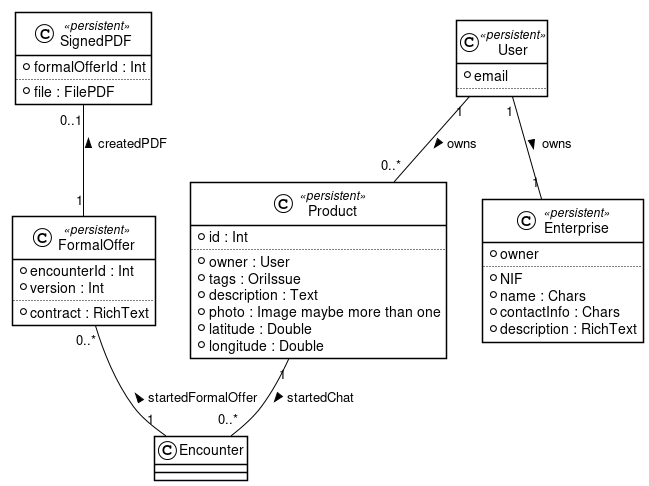

# Commed Backend

## Database Model


## Structure

```
.
|- doc -- Contains documentation about the project, 
|  |      as well as scripts, mainly plantuml, for 
|  |      generating the diagrams
|  | 
|  | 
```

## Stack Used
- Django :: We will use Django for power up most of the services provided by the application
  + django-channels :: It powers up django to provide WebSockets, used by the chat.
  + django-richtextfield :: It gaves us a higher level RichTextField for the database.
- Spacy :: it provides us a way to achieve a better ontology for searching

## Collaborators
- @quimpm
- @Oriolac
- @Emina33
- @sergis

